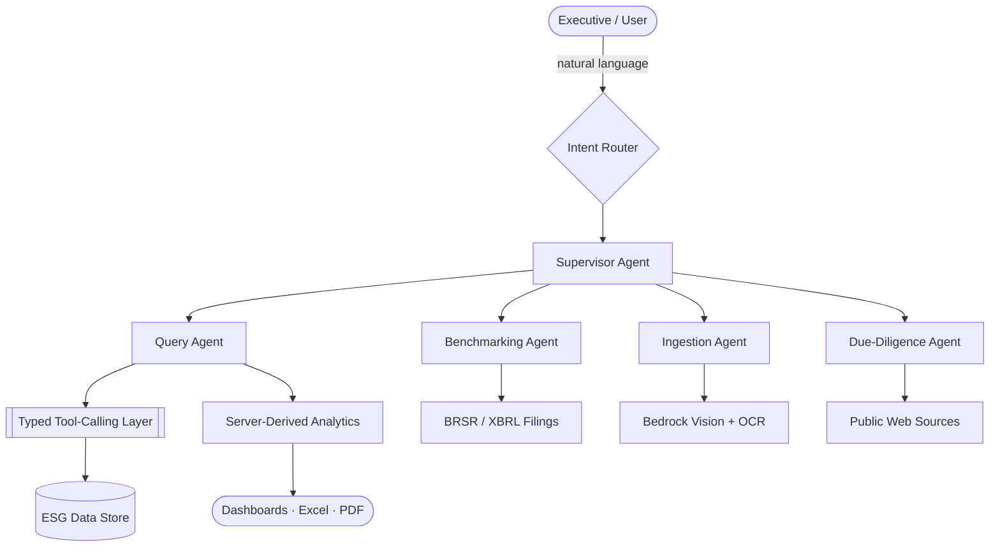

<h1 align="center">Priyank Agrawal</h1>

  <b>AI / LLM Engineer</b> · Production multi-agent systems, RAG, and agentic workflows

  
  
  
  

---

## Overview

I'm an AI/LLM engineer with **3+ years** shipping production systems, currently building agentic AI at **Planet Sustech**. My work centers on **multi-agent orchestration, typed tool-calling, and RAG** — the unglamorous engineering that makes LLMs behave like reliable systems rather than demos.

I care about the parts that decide whether an agent survives contact with production: deterministic tool boundaries, server-derived analytics that kill hallucination, structured extraction from messy real-world inputs, and orchestration that degrades gracefully. Most of my recent systems run on **LangGraph** and **AWS Bedrock**, backed by NestJS/FastAPI services and Postgres/MongoDB.

---

## Production Agentic Systems

Systems I've designed and shipped at **Planet Sustech** — ESG/climate domain, real users, real data.

### KarbonIQ — Conversational ESG Agent
A supervisor-routed agent (**AWS Bedrock · LangGraph**) exposing **21 typed tool-calling functions** for natural-language ESG querying. Instead of NL-to-query generation, every answer flows through **server-derived analytics**, which eliminates LLM hallucination on numbers. Auto-generates executive dashboards with Excel/PDF export and **RBAC across 4 roles**. Cut manual analysis time by **~70%**.

### AI Data-Ingestion Agent
A **vision + OCR** pipeline (Bedrock) that extracts ESG metrics from **8+ document formats** — PDF, Excel, scanned images, email — and auto-calculates **Scope 1/2/3 emissions** at **95% extraction confidence**. Deployed on **AWS ECS Fargate**.

### ESG Benchmarking Agent
Ingests **BRSR/XBRL filings for 987+ listed companies** to produce **SASB-weighted peer scoring**, percentile rankings, gap-to-leader analysis, and 5 AI-generated improvement recommendations per company.

### Supplier Due-Diligence Agent
Scrapes supplier data from public sources, **auto-builds custom assessments** for data gaps, and runs an **autonomous follow-up sub-agent** to chase responses — targeting **~60% faster** supplier onboarding.

---

## How I Architect Agents

A representative multi-agent pattern from my work — supervisor routing, specialized agents, a typed tool boundary, and analytics derived on the server rather than by the model.

**Principles I build by:** typed tools over free-form generation · compute answers server-side, let the model orchestrate · sub-agents for autonomous follow-through · RBAC and auditability from day one.

---

## Selected Projects

| Project | What it is | Stack |
|---|---|---|
| **[NextRole](https://github.com/Priyank032/ai-career-copilot)** | 7-agent conversational job-search & career-coaching system with intent classification, multi-turn context management, and SSE streaming (90%+ routing accuracy) | `FastAPI` · `Next.js` · `LangChain` · `Groq LLaMA 3.3` · `Supabase` |
| **ESG Analytics Chatbot** | RAG assistant converting natural language into MongoDB aggregation pipelines at 95%+ accuracy | `Node.js` · `LangChain` · `MongoDB` · `RAG` |
| **Speedbox** | Serverless logistics platform — microservices on Lambda, OAuth 2.0, auto-scaling to 10k+ concurrent requests, 99.9% uptime | `AWS Lambda` · `Cognito` · `SNS` · `PostgreSQL` |

---

## Tech Stack

<b>AI / LLM</b>

 

**Focus:** Multi-Agent Orchestration · Typed Tool-Calling · RAG · Intent Routing · Structured Extraction · Prompt Engineering

<b>Backend & APIs</b>

 

<b>Data & Infra</b>

 

**AWS:** Lambda · ECS Fargate · Bedrock · SNS · SES · Cognito &nbsp;|&nbsp; **CI/CD:** GitHub Actions

<b>Frontend & Realtime</b>

 

---

## Experience

**Software Engineer — AI/LLM** · Planet Sustech Private Limited · *Aug 2024 – Present*
Built KarbonIQ and a suite of production ESG agents on AWS Bedrock + LangGraph. Owned agent architecture end to end — from tool-calling design and structured extraction to RBAC and deployment — and mentor a team of interns.

**Associate Software Developer** · Antino Labs Private Limited · *Feb 2023 – Aug 2024*
Engineered a Resource Management System for 400+ employees (Node.js, PostgreSQL, real-time analytics) and a social platform with AI-driven matching and Socket.IO/Agora realtime — 10k+ downloads in 4 months, +30% engagement.

---

## GitHub

---

  <b>Open to:</b> AI/LLM Engineering · Agentic Systems · Full-Stack (AI focus) 
  📍 Bhopal, Madhya Pradesh, India &nbsp;·&nbsp; 🎓 B.Tech CSE, IPS College of Technology & Management (CGPA 8.2)

